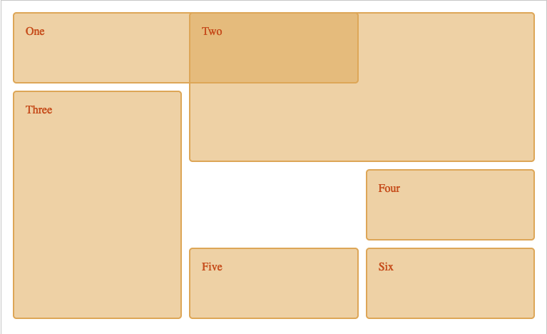

# CSS Grid & Flexbox for Responsive Layouts

## CSS Grid
CSS Grid layout is designed to work with 2 dimensions. Use either Flexbox or Grid where they make the more sense. The **CSS grid** layout module excels at dividing a page into major regions or defining the relationship in terms of size, position, and layer, between parts of a control built from HTML primitives. Think of it like tables, that enables you to organize or align your boxes in terms of rows and columns. Consider:
```html
<!-- HTML -->
<div class="wrapper">
  <div class="one">One</div>
  <div class="two">Two</div>
  <div class="three">Three</div>
  <div class="four">Four</div>
  <div class="five">Five</div>
  <div class="six">Six</div>
</div>
```
```css
/* CSS */
.wrapper {
  display: grid;
  grid-template-columns: repeat(3, 1fr);
  gap: 10px;
  grid-auto-rows: minmax(100px, auto);
}
.one {
  grid-column: 1 / 3;
  grid-row: 1;
}
.two {
  grid-column: 2 / 4;
  grid-row: 1 / 3;
}
.three {
  grid-column: 1;
  grid-row: 2 / 5;
}
.four {
  grid-column: 3;
  grid-row: 3;
}
.five {
  grid-column: 2;
  grid-row: 4;
}
.six {
  grid-column: 3;
  grid-row: 4;
}
```
You'll end up with:

You can define custom widths and heights of each rows and columns with the properties `grid-template-columns` and `grid-template-rows` and the syntax is like:
```css
grid-template-columns: 60px 60px;
```
If we have 2 columns, then they'll look like:


To not specify each size manually we can leverage of the syntax `repeat`. The **repeat()** CSS function represents a repeated fragment of the track list, allowing a large number of columns or rows that exhibit a recurring pattern to be written in a more compact form.
```css
grid-template-columns: repeat(2, 60px);
```
The repeat() function takes two arguments:
  - **repeat count**: the first argument specifies the number of times that the track list should be repeated. It is specified with an integer value of 1 or more, or with the keyword values auto-fill or auto-fit. These keyword values repeat the set of tracks as many times as is needed to fill the grid container.
  - **tracks**: the second argument specifies the set of tracks that will be repeated. Fundamentally this consists of one or more values, where each value represents the size of that track. Each size is specified using either a `<track-size>` value or a `<fixed-size>` value. You can also specify one or more line names before or after each track, by providing `<line-names>` values before and/or after the track size.