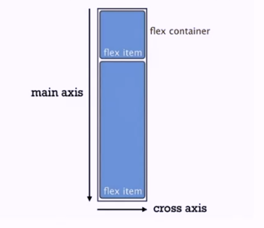
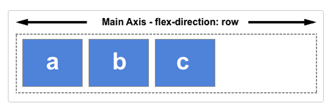
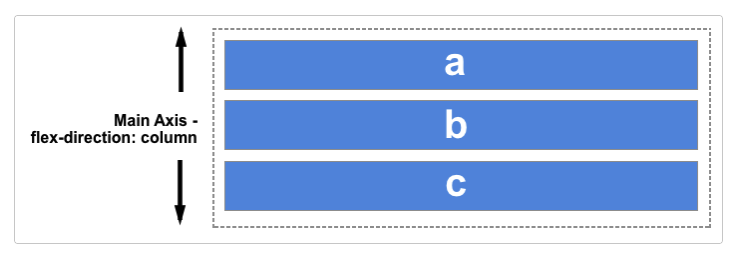
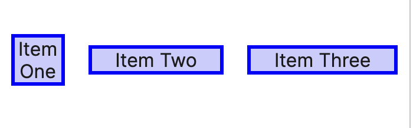
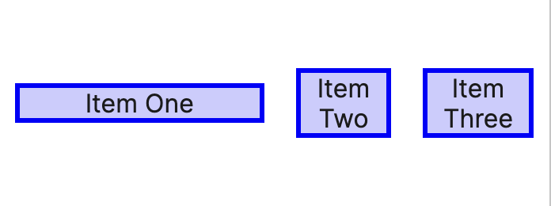

# CSS Grid & Flexbox for Responsive Layouts

## Flexbox
Flexbox stands for flexible boxes. Flexbox was though to layout in one direction at a time (in contrast with _grid_ layouts). There are some concepts that comes with flexbox which are:

- **Main axis**
- **Cross axis**
- **Flex container**
- **Flex item**

Which are easier to think about with an image:

Consider:
```html
<ul style="display: flex;">
  <li>1</li>
  <li>2</li>
  <li>3</li>
</ul>
```
In this case, the `ul` element is the flex container and the `li` elements are the flex items.

### The two axes of flexbox
When working with flexbox you need to think in terms of two axes, he main axis and the cross axis. The main axis is defined by the `flex-direction` property, and the cross axis runs perpendicular to it. The main axis can be set two 4 possible values:
- **row**
- **row-reverse**
- 
- **column**
- **column-reverse**

The cross axis is then, the perpendicular axis to the defined main axis.

### FLex basis
Is a property that sets the initial main size of the flex item. It sets the size of the content. Consider:
```css
flex-basis: 0;
```

But if:
```css
flex-basis: 200px;
```
