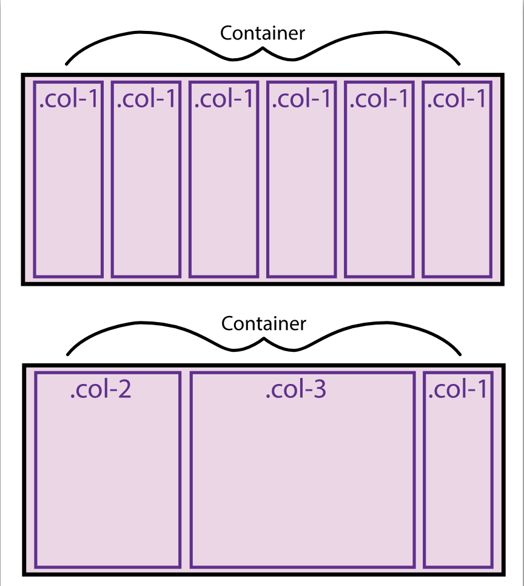

# CSS Grid & Flexbox for Responsive Layouts

## Flexbox Grid System
Though flexbox is mean to layout in one direction, you can make a whole grid system by stacking rows on top of each other. Technically there has to be flex containers on top of each other:
. This is achieved by arranging the html like so:
```html
<div class="flex-container">
  <div class="col-2">
    <p>Contents of first col</p>
  </div>
  <div class="col-3">
    <p>Contents of second col</p>
  </div>
  <div class="col-1">
    <p>Contents of third col</p>
  </div>
</div>
```
and the CSS like so:
```css
.flex-container{
  display: flex;
  flex-wrap: wrap;
}
```

### Media queries
**Media queries** allow you to apply CSS styles depending on a device's general type (such as screen size). A media query is composed of an optional _media_ type and any number of media _feature_ expressions, which may optionally be combined in various ways using _logical_ operators_.
- **Media types**: define a broad category of device which the media query applies: _all_, _print_, _screen_. 
- **Media features**: describe a specific characteristic of the [user agent](https://developer.mozilla.org/en-US/docs/Glossary/User_agent), output device or environment. Consider:
```css
@media (max-width: 1250px) {
  /* … */
}
```
To combine multiple types or features is possible doing it with the logical operators like so:
```css
@media screen and (min-width: 30em) and (orientation: landscape) {
  /* … */
}
```

