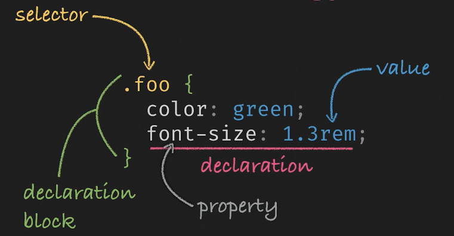

# Sass Fundamentals
## Sass Basics
Since _Sass_ is not Css we might then need to compile it down to Css. There are many pre-processors such as:

- [Sass](https://sass-lang.com/)
- [Less](https://lesscss.org/)
- [stylus](https://stylus-lang.com/)

Sass stands for Syntactically awesome style sheets. To get started, we can go through some terminology:


### Nesting and scoping
Sass will let you nest your CSS selectors in a way that follows the same visual hierarchy of your HTML. Be aware that overly nested rules will result in over-qualified CSS that could prove hard to maintain and is generally considered bad practice. Consider:
```css
nav ul {
  margin: 0;
  padding: 0;
  list-style: none;
}
nav li {
  display: inline-block;
}
nav a {
  display: block;
  padding: 6px 12px;
  text-decoration: none;
}
```
It can be re-written in Sass like:
```css
nav {
  ul {
    margin: 0;
    padding: 0;
    list-style: none;
  }

  li { display: inline-block; }

  a {
    display: block;
    padding: 6px 12px;
    text-decoration: none;
  }
}
```
As noted in the code, styles can  be placed in the declaration block of a parent element.

We can use the selectors as we may expect in css like the **Parent selector**:
```css
.container {
  &.right-nav {
    color: #333;
  }
}
```
would end up to css like:
```css
.container.right-van {
  color: #333;
}
```
The parent selector is often useful in situations where adding a secondary class changes styles.

### Import & Variables
Think of variables as a way to store information that you want to reuse throughout your stylesheet. You can store things like colors, font stacks, or any CSS value you think you’ll want to reuse. Sass uses the $ symbol to make something a variable. Here’s an example:
```scss
$font-stack: Helvetica, sans-serif;
$primary-color: #333;

body {
  font: 100% $font-stack;
  color: $primary-color;
}
```
In Css would look like:
```css
body {
  font: 100% Helvetica, sans-serif;
  color: #333;
}
```
When the Sass is processed, it takes the variables we define for the `$font-stack` and `$primary-color` and outputs normal CSS with our variable values placed in the CSS. This can be extremely powerful when working with brand colors and keeping them consistent throughout the site.

!IMPORTANT NOTICE¡

Even though is part of the course; [The Sass documentation discourages for the use of the `@import` rule](https://sass-lang.com/documentation/at-rules/import/). Prefer the `@use` rule instead.

Sass extends CSS’s `@import` rule with the ability to import Sass and CSS stylesheets, providing access to mixins, functions, and variables and combining multiple stylesheets’ CSS together. Unlike plain CSS imports, which require the browser to make multiple HTTP requests as it renders your page, Sass imports are handled entirely during compilation.

You can create partial Sass files that contain little snippets of CSS that you can include in other Sass files. This is a great way to modularize your CSS and help keep things easier to maintain. A partial is a Sass file named with a leading underscore. You might name it something like __partial_.scss. The underscore lets Sass know that the file is only a partial file and that it should not be generated into a CSS file. Sass partials are used with the @use rule.

A really cool feature is Sass is that you are able to create local variables like so:
```scss
$error_color: #f00 !default; // Global variable

.alert-error {
  $text_color: #ddd;// Local variable
}
```
Also, the `!default` means that the variable `$error_color` is going to be defined as `#f00` unless is set elsewhere.

### Mixins
Mixins are the primary way to re use styles in Scss. Some things in CSS are a bit tedious to write, especially with CSS3 and the many vendor prefixes that exist. A mixin lets you make groups of CSS declarations that you want to reuse throughout your site. It helps keep your Sass very DRY. You can even pass in values to make your mixin more flexible. Here’s an example for _theme_.
```scss
@mixin theme($theme: DarkGray) {
  background: $theme;
  box-shadow: 0 0 1px rgba($theme, .25);
  color: #fff;
}

.info {
  @include theme;
}
.alert {
  @include theme($theme: DarkRed);
}
.success {
  @include theme($theme: DarkGreen);
}
```
In Css would look like:
```css
.info {
  background: DarkGray;
  box-shadow: 0 0 1px rgba(169, 169, 169, 0.25);
  color: #fff;
}

.alert {
  background: DarkRed;
  box-shadow: 0 0 1px rgba(139, 0, 0, 0.25);
  color: #fff;
}

.success {
  background: DarkGreen;
  box-shadow: 0 0 1px rgba(0, 100, 0, 0.25);
  color: #fff;
}
```
You can think of _mixins_ like functions that returns css styles. For a global advice have your _mixins_ in a separate `_mixins.scss` partial and import them after the `_variables.scss` partial because you often want your mixins to depend on those __variables_.

### Functions
Functions allow you to define complex operations on [SassScript values](https://sass-lang.com/documentation/values/) that you can re-use throughout your stylesheet. They make it easy to abstract out common formulas and behaviors in a readable way.

Functions are defined using the @function at-rule, which is written @function <name>(<arguments...>) { ... }. A function’s name can be any Sass identifier. It can only contain universal statements, as well as the @return at-rule which indicates the value to use as the result of the function call. Functions are called using the normal CSS function syntax.
```scss
@function fibonacci($n) {
  $sequence: 0 1;
  @for $_ from 1 through $n {
    $new: nth($sequence, length($sequence)) + nth($sequence, length($sequence) - 1);
    $sequence: append($sequence, $new);
  }
  @return nth($sequence, length($sequence));
}

.sidebar {
  float: left;
  margin-left: fibonacci(4) * 1px;
}
```

### Control flow - @if
As in any programming language, you are able to parametrize styles with the `@if - else` statements. The @if rule is written @if <expression> { ... }, and it controls whether or not its block gets evaluated (including emitting any styles as CSS). The expression usually returns either true or false—if the expression returns true, the block is evaluated, and if the expression returns false it’s not.
```scss
@use "sass:math";

@mixin avatar($size, $circle: false) {
  width: $size;
  height: $size;

  @if $circle {
    border-radius: math.div($size, 2);
  }
}

.square-av {
  @include avatar(100px, $circle: false);
}
.circle-av {
  @include avatar(100px, $circle: true);
}
```
In Css would look like:
```css
.banner {
  background-color: #f2ece4;
  color: #036;
}
body.dark .banner {
  background-color: #6b717f;
  color: #d2e1dd;
}
```