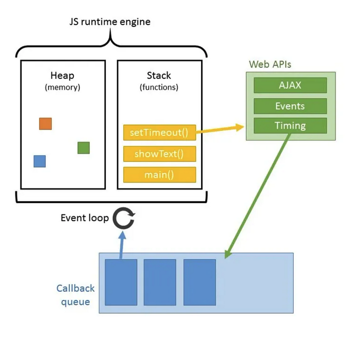

# Asynchronous Javascript Deep Dive
## Understanding Asynchronous Coding

- Advantages Easy to read and reason about. Very performant.
- Disadvantage: May create Blocking code. Low performance.

## The event loop: basic understanding
The purpose of the event loop is to make sure all the code is handled. Since Javascript is a single threaded environment, the event loop makes possible to run asynchronous code.

1. **The heap**: This is the physical memory space that is used to store variables, functions, and objects. Since everything in Javascript is an object, anything that is allocated in memory using the new keyword is stored in the heap. Javascript also has a garbage collector that frees the allocated memory so that it does not have to be freed manually like in C/C++.
2. **The stack**: This is where function and API calls (Web API in browsers and C/C++ API on local machines via NodeJs) are stored. This part behaves just like a typical stack data structure with a last-in-first-out structure (LIFO). Function calls are added to the top of the stack and popped off from the top after execution completes.
3. **API’s (Web or C/C++)**: This is where the actual functionality for built-in functions like setTimeout() and fetch() are located. In a way, functions like setTimeout() can be thought of as activating the API function, and then being popped off the call stack right away while the API function continues to run in the background (in this case, a timer is run in the background).
4. **Callback queue**: Some functions like setTimeout() that contact the API’s require a callback function to be provided to it so that it knows what to do after the API function has been run. In this case, the callback functions are placed in the callback queue. The queue itself behaves just like a queue data structure as a first-in-first-out structure (FIFO).
5. **Event loop**: The event loop is an algorithm that constantly checks the call stack to see if there are any function calls that need to be run. When the call stack is empty, the first entry in the callback queue is pushed onto the call stack to complete execution. This happens until the queue is empty.