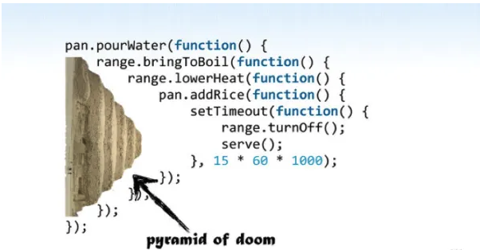

# Asynchronous Javascript deep dive
## Section 3: The necessity of Callbacks.
Since _functions_ in Javascript are first-class citizens, they are a special kind of object, and can be then, treated like so, which means can be passed around like other functions parameters. This is important because they are the pillar of Asynchronous code in Javascript.

### Exercise 0
```js
let value = 1;

doSomething(() => {
  value = 2;
});

console.log(value);
```
If _doSomething_ calls the callback synchronously, then the last statement would log _2_ because `value = 2` is synchronously executed; otherwise, if the callback is asynchronous, the last statement would log _1_ because `value = 2` is only executed after the `console.log` statement.

### The problems with callbacks
- Callback hell: Where there are too many callbacks nested.
- Difficult to Reason about.
- Inversion of control: You leave control of your code to something else (a callback)


This is all the issues of the callbacks in one simple image, when you nest a lot of callbacks you can get this code that is hard to read, hard to reason about, and you even lose control to where the control is.