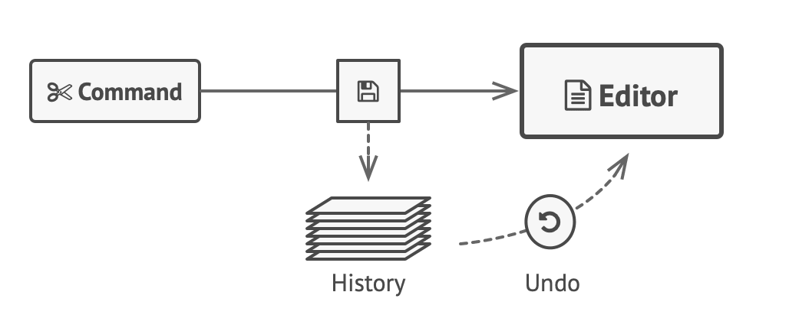

# Design Patterns in Javascript

## OOP and S.O.L.I.D. principles
Object-Oriented Programming is a programming style based on classes and objects. These group data (properties) and methods (actions) inside a box. 

    JavaScript is prototype-based procedural language, which means it supports both functional and object-oriented programming.

Classes were introduced to _Javascript_ with ECMAScript 2015 and they're just a syntantic sugar to **Prototypal Inheritance**. We then have an object linked to a prototype. Prototypes contain all methods and these methods are accessible to all objects linked to this prototype.

You can declare a class using the class keyword. Here's a class declaration for our Person from the previous article:
```js
class Person {
  name;

  constructor(name) {
    this.name = name;
  }

  introduceSelf() {
    console.log(`Hi! I'm ${this.name}`);
  }
}

```
The SOLID Principles are five principles of Object-Oriented class design. They are a set of rules and best practices to follow while designing a class structure. Following the SOLID acronym, they are:
- The Single Responsibility Principle:

The Single Responsibility Principle states that a class should do one thing and therefore it should have only a single reason to change. 

1. The Open-Closed Principle

The Open-Closed Principle requires that classes should be open for extension and closed to modification. Modification means changing the code of an existing class, and extension means adding new functionality.

2. The Liskov Substitution Principle

The Liskov Substitution Principle states that subclasses should be substitutable for their base classes. This means that, given that class B is a subclass of class A, we should be able to pass an object of class B to any method that expects an object of class A and the method should not give any weird output in that case. 

3. The Interface Segregation Principle

Segregation means keeping things separated, and the Interface Segregation Principle is about separating the interfaces. The principle states that many client-specific interfaces are better than one general-purpose interface. Clients should not be forced to implement a function they do no need. 

4. The Dependency Inversion Principle

The Dependency Inversion principle states that our classes should depend upon interfaces or abstract classes instead of concrete classes and functions. 
    "If the OCP states the goal of OO architecture, the DIP states the primary mechanism". 

## ¿What are design patterns?
Design patterns are typical solutions to common problems in software design. Each pattern is like a blueprint that you can customize to solve a particular design problem in your code. You can’t just find a pattern and copy it into your program, the way you can with off-the-shelf functions or libraries. The pattern is not a specific piece of code, but a general concept for solving a particular problem. You can follow the pattern details and implement a solution that suits the realities of your own program.

Design patterns are a toolkit of tried and tested solutions to common problems in software design. Even if you never encounter these problems, knowing patterns is still useful because it teaches you how to solve all sorts of problems using principles of object-oriented design.

### The catalog of design patterns
1. Creational patterns: These patterns provide various object creation mechanisms, which increase flexibility and reuse of existing code.
2. Structural patterns: These patterns explain how to assemble objects and classes into larger structures while keeping these structures flexible and efficient.
3. Behavioral patterns: These patterns are concerned with algorithms and the assignment of responsibilities between objects.

## Creational patterns

### Builder
    When piecewise object construction is complicated, provide an API for doing it succintly.
A builder is something that helps you to construct a particular object. **Builder** is a creational design pattern that lets you construct complex objects step by step. The pattern allows you to produce different types and representations of an object using the same construction code.

Imagine a complex object that requires laborious, step-by-step initialization of many fields and nested objects. Such initialization code is usually buried inside a monstrous constructor with lots of parameters. Or even worse: scattered all over the client code. The Builder pattern suggests that you extract the object construction code out of its own class and move it to separate objects called builders. The pattern organizes object construction into a set of steps (buildWalls, buildDoor, etc.). To create an object, you execute a series of these steps on a builder object. The important part is that you don’t need to call all of the steps. You can call only those steps that are necessary for producing a particular configuration of an object.

```ts
/**
 * The Builder interface specifies methods for creating the different parts of
 * the Product objects.
 */
interface Builder {
    producePartA(): void;
    producePartB(): void;
    producePartC(): void;
}

class ConcreteBuilder1 implements Builder {
    private product: Product1;

    /**
     * A fresh builder instance should contain a blank product object, which is
     * used in further assembly.
     */
    constructor() {
        this.reset();
    }

    public reset(): void {
        this.product = new Product1();
    }

    /**
     * All production steps work with the same product instance.
     */
    public producePartA(): void {
        this.product.parts.push('PartA1');
    }

    public producePartB(): void {
        this.product.parts.push('PartB1');
    }
    .
    .
    .
}
```
So, instead of having a huge constructor, you end up with another class that helps you build the object you desire, this could be also a disadvantage since you'll end up adding complexity to your code by adding more additional classes to it.

### Factory
Factory Method is a creational design pattern that provides an interface for creating objects in a superclass, but allows subclasses to alter the type of objects that will be created. Imagine that you’re creating a logistics management application. The first version of your app can only handle transportation by trucks, so the bulk of your code lives inside the `Truck` class.

After a while, your app becomes pretty popular. Each day you receive dozens of requests from sea transportation companies to incorporate sea logistics into the app.

How about the code? At present, most of your code is coupled to the `Truck` class. Adding `Ships` into the app would require making changes to the entire codebase. Moreover, if later you decide to add another type of transportation to the app, you will probably need to make all of these changes again.

As a result, you will end up with pretty nasty code, riddled with conditionals that switch the app’s behavior depending on the class of transportation objects.

The Factory Method pattern suggests that you replace direct object construction calls (using the new operator) with calls to a special factory method. Don’t worry: the objects are still created via the new operator, but it’s being called from within the factory method. Objects returned by a factory method are often referred to as products.

```js
abstract class Creator {
    /**
     * Note that the Creator may also provide some default implementation of the
     * factory method.
     */
    public abstract factoryMethod(): Product;

    /**
     * Also note that, despite its name, the Creator's primary responsibility is
     * not creating products. Usually, it contains some core business logic that
     * relies on Product objects, returned by the factory method. Subclasses can
     * indirectly change that business logic by overriding the factory method
     * and returning a different type of product from it.
     */
    public someOperation(): string {
        // Call the factory method to create a Product object.
        const product = this.factoryMethod();
        // Now, use the product.
        return `Creator: The same creator's code has just worked with ${product.operation()}`;
    }
}
```

### Prototype
Prototype is a creational design pattern that lets you copy existing objects without making your code dependent on their classes.

Say you have an object, and you want to create an exact copy of it. How would you do it? First, you have to create a new object of the same class. Then you have to go through all the fields of the original object and copy their values over to the new object. There’s a catch. Not all objects can be copied that way because some of the object’s fields may be private and not visible from outside of the object itself.

Here’s one more problem with the direct approach. Since you have to know the object’s class to create a duplicate, your code becomes dependent on that class. If the extra dependency doesn’t scare you, there’s another catch. Sometimes you only know the interface that the object follows, but not its concrete class, when, for example, a parameter in a method accepts any objects that follow some interface.

The Prototype pattern delegates the cloning process to the actual objects that are being cloned. The pattern declares a common interface for all objects that support cloning. This interface lets you clone an object without coupling your code to the class of that object. Usually, such an interface contains just a single clone method. The implementation of the clone method is very similar in all classes. The method creates an object of the current class and carries over all of the field values of the old object into the new one. You can even copy private fields because most programming languages let objects access private fields of other objects that belong to the same class.

```ts
/**
 * The example class that has cloning ability.
 */
class Prototype {
    public primitive: any;
    public component: object;
    public circularReference: ComponentWithBackReference;

    public clone(): this {
        const clone = Object.create(this);

        clone.component = Object.create(this.component);

        // Cloning an object that has a nested object with backreference
        // requires special treatment. After the cloning is completed, the
        // nested object should point to the cloned object, instead of the
        // original object. Spread operator can be handy for this case.
        clone.circularReference = {
            ...this.circularReference,
            prototype: { ...this },
        };

        return clone;
    }
}
```

### Singleton
Singleton is a creational design pattern that lets you ensure that a class has only one instance, while providing a global access point to this instance. Singleton ensure that a class has just a single instance. Why would anyone want to control how many instances a class has? The most common reason for this is to control access to some shared resource—for example, a database or a file.

All implementations of the Singleton have these two steps in common:

- Make the default constructor private, to prevent other objects from using the _new_ operator with the Singleton class.
- Create a static creation method that acts as a constructor. Under the hood, this method calls the private constructor to create an object and saves it in a static field. All following calls to this method return the cached object.

Since we don't have private keyword in Javascript, we can create a singleton like:
```js
class Counter {
  constructor() {
    if (instance) {
      throw new Error("You can only create one instance!");
    }
    this.counter = counter;
    instance = this;
  }

  getCount() {
    return this.counter;
  }
}

// 2. Setting a variable equal to the the frozen newly instantiated object, by using the built-in `Object.freeze` method.
// This ensures that the newly created instance is not modifiable.
const singletonCounter = Object.freeze(new Counter());

// 3. Exporting the variable as the `default` value within the file to make it globally accessible.
export default singletonCounter;
```
Nowadays we can create private class methods leveraging the # prefix on a class method, but not with te constructor.

## Structural design patterns

### Adapter
Adapter is a structural design pattern that allows objects with incompatible interfaces to collaborate. Imagine that you’re creating a stock market monitoring app. The app downloads the stock data from multiple sources in XML format and then displays nice-looking charts and diagrams for the user. At some point, you decide to improve the app by integrating a smart 3rd-party analytics library. But there’s a catch: the analytics library only works with data in JSON format. You could change the library to work with XML. However, this might break some existing code that relies on the library. And worse, you might not have access to the library’s source code in the first place, making this approach impossible.

You can create an adapter. This is a special object that converts the interface of one object so that another object can understand it. An adapter wraps one of the objects to hide the complexity of conversion happening behind the scenes. The wrapped object isn’t even aware of the adapter. For example, you can wrap an object that operates in meters and kilometers with an adapter that converts all of the data to imperial units such as feet and miles. Adapters can not only convert data into various formats but can also help objects with different interfaces collaborate. Here’s how it works:


- The adapter gets an interface, compatible with one of the existing objects.
- Using this interface, the existing object can safely call the adapter’s methods.
- Upon receiving a call, the adapter passes the request to the second object, but in a format and order that the second object expects.

```js
/**
 * The Target defines the domain-specific interface used by the client code.
 */
class Target {
    public request(): string {
        return 'Target: The default target\'s behavior.';
    }
}

/**
 * The Adaptee contains some useful behavior, but its interface is incompatible
 * with the existing client code. The Adaptee needs some adaptation before the
 * client code can use it.
 */
class Adaptee {
    public specificRequest(): string {
        return '.eetpadA eht fo roivaheb laicepS';
    }
}

/**
 * The Adapter makes the Adaptee's interface compatible with the Target's
 * interface.
 */
class Adapter extends Target {
    private adaptee: Adaptee;

    constructor(adaptee: Adaptee) {
        super();
        this.adaptee = adaptee;
    }

    public request(): string {
        const result = this.adaptee.specificRequest().split('').reverse().join('');
        return `Adapter: (TRANSLATED) ${result}`;
    }
}
```

### Bridge
Bridge is a structural design pattern that lets you split a large class or a set of closely related classes into two separate hierarchies—abstraction and implementation—which can be developed independently of each other. The bridge pattern decouples an abstraction from its implementation so that the two can change independently. Bridge is a structural design pattern that divides business logic or huge class into separate class hierarchies that can be developed independently.
```cpp
#include<iostream>
#include<string>
using namespace std;
 
class MoveLogic {
public:
    virtual void move() = 0;
};
 
class Walk : public MoveLogic {
public:
    void move() { cout << "Move alternating legs\n"; }
};
 
class Fly : public MoveLogic {
public:
    void move() { cout << "Flap wings\n"; }
};

class Animal {
public:
    virtual void howDoIMove() = 0;
};
 
class Person : public Animal {
    MoveLogic* _myMoveLogic;
public:
    // Constructor receives the MoveLogic object to be initialized
    Person(MoveLogic *obj): _myMoveLogic(obj){}    void howDoIMove() {
        _myMoveLogic->move();
    }
};
 
class Bird : public Animal {
    MoveLogic* _myMoveLogic;
public:
    Bird(MoveLogic *obj) :_myMoveLogic(obj){}
    void howDoIMove() {
        _myMoveLogic->move();
    }
};
```
So the bridge design pattern is just to add an abstraction over the abstraction to decouple interfaces from logic.

### Composite
Composite is a structural design pattern that lets you compose objects into tree structures and then work with these structures as if they were individual objects. Using the Composite pattern makes sense only when the core model of your app can be represented as a tree.

Composite pattern base component defines the common methods for leaf and composites. We can create a class Shape with a method draw(String fillColor) to draw the shape with given color: `Shape.java`
```java
package com.journaldev.design.composite;

public interface Shape {
	
	public void draw(String fillColor);
}
```

Composite design pattern leaf implements base component and these are the building block for the composite. We can create multiple leaf objects such as Triangle, Circle etc: `Triangle.java`
```java
package com.journaldev.design.composite;

public class Triangle implements Shape {

	@Override
	public void draw(String fillColor) {
		System.out.println("Drawing Triangle with color "+fillColor);
	}

}
```
A composite object contains group of leaf objects and we should provide some helper methods to add or delete leafs from the group. We can also provide a method to remove all the elements from the group: `Drawing.java`
```java
package com.journaldev.design.composite;

import java.util.ArrayList;
import java.util.List;

public class Drawing implements Shape{

	//collection of Shapes
	private List<Shape> shapes = new ArrayList<Shape>();
	
	@Override
	public void draw(String fillColor) {
		for(Shape sh : shapes)
		{
			sh.draw(fillColor);
		}
	}
	
	//adding shape to drawing
	public void add(Shape s){
		this.shapes.add(s);
	}
	
	//removing shape from drawing
	public void remove(Shape s){
		shapes.remove(s);
	}
	
	//removing all the shapes
	public void clear(){
		System.out.println("Clearing all the shapes from drawing");
		this.shapes.clear();
	}
}
```

### Decorator
Decorator is a structural design pattern that lets you attach new behaviors to objects by placing these objects inside special wrapper objects that contain the behaviors. Extending a class is the first thing that comes to mind when you need to alter an object’s behavior. However, inheritance has several serious caveats that you need to be aware of.

- Inheritance is static. You can’t alter the behavior of an existing object at runtime. You can only replace the whole object with another one that’s created from a different subclass.
- Subclasses can have just one parent class. In most languages, inheritance doesn’t let a class inherit behaviors of multiple classes at the same time.

“Wrapper” is the alternative nickname for the Decorator pattern that clearly expresses the main idea of the pattern. A wrapper is an object that can be linked with some target object. The wrapper contains the same set of methods as the target and delegates to it all requests it receives. However, the wrapper may alter the result by doing something either before or after it passes the request to the target.

```ts
/**
 * The base Component interface defines operations that can be altered by
 * decorators.
 */
interface Component {
    operation(): string;
}

/**
 * Concrete Components provide default implementations of the operations. There
 * might be several variations of these classes.
 */
class ConcreteComponent implements Component {
    public operation(): string {
        return 'ConcreteComponent';
    }
}

/**
 * The base Decorator class follows the same interface as the other components.
 * The primary purpose of this class is to define the wrapping interface for all
 * concrete decorators. The default implementation of the wrapping code might
 * include a field for storing a wrapped component and the means to initialize
 * it.
 */
class Decorator implements Component {
    protected component: Component;

    constructor(component: Component) {
        this.component = component;
    }

    /**
     * The Decorator delegates all work to the wrapped component.
     */
    public operation(): string {
        return this.component.operation();
    }
}

/**
 * Concrete Decorators call the wrapped object and alter its result in some way.
 */
class ConcreteDecoratorA extends Decorator {
    /**
     * Decorators may call parent implementation of the operation, instead of
     * calling the wrapped object directly. This approach simplifies extension
     * of decorator classes.
     */
    public operation(): string {
        return `ConcreteDecoratorA(${super.operation()})`;
    }
}

/**
 * Decorators can execute their behavior either before or after the call to a
 * wrapped object.
 */
class ConcreteDecoratorB extends Decorator {
    public operation(): string {
        return `ConcreteDecoratorB(${super.operation()})`;
    }
}

/**
 * The client code works with all objects using the Component interface. This
 * way it can stay independent of the concrete classes of components it works
 * with.
 */
function clientCode(component: Component) {
    // ...

    console.log(`RESULT: ${component.operation()}`);

    // ...
}

/**
 * This way the client code can support both simple components...
 */
const simple = new ConcreteComponent();
console.log('Client: I\'ve got a simple component:');
clientCode(simple);
console.log('');

/**
 * ...as well as decorated ones.
 *
 * Note how decorators can wrap not only simple components but the other
 * decorators as well.
 */
const decorator1 = new ConcreteDecoratorA(simple);
const decorator2 = new ConcreteDecoratorB(decorator1);
console.log('Client: Now I\'ve got a decorated component:');
clientCode(decorator2);
```


### Facade
Facade is a structural design pattern that provides a simplified interface to a library, a framework, or any other complex set of classes. A facade is a class that provides a simple interface to a complex subsystem which contains lots of moving parts. A facade might provide limited functionality in comparison to working with the subsystem directly. However, it includes only those features that clients really care about. Having a facade is handy when you need to integrate your app with a sophisticated library that has dozens of features, but you just need a tiny bit of its functionality.

```ts
/**
 * The Facade class provides a simple interface to the complex logic of one or
 * several subsystems. The Facade delegates the client requests to the
 * appropriate objects within the subsystem. The Facade is also responsible for
 * managing their lifecycle. All of this shields the client from the undesired
 * complexity of the subsystem.
 */
class Facade {
    protected subsystem1: Subsystem1;

    protected subsystem2: Subsystem2;

    /**
     * Depending on your application's needs, you can provide the Facade with
     * existing subsystem objects or force the Facade to create them on its own.
     */
    constructor(subsystem1?: Subsystem1, subsystem2?: Subsystem2) {
        this.subsystem1 = subsystem1 || new Subsystem1();
        this.subsystem2 = subsystem2 || new Subsystem2();
    }

    /**
     * The Facade's methods are convenient shortcuts to the sophisticated
     * functionality of the subsystems. However, clients get only to a fraction
     * of a subsystem's capabilities.
     */
    public operation(): string {
        let result = 'Facade initializes subsystems:\n';
        result += this.subsystem1.operation1();
        result += this.subsystem2.operation1();
        result += 'Facade orders subsystems to perform the action:\n';
        result += this.subsystem1.operationN();
        result += this.subsystem2.operationZ();

        return result;
    }
}

/**
 * The Subsystem can accept requests either from the facade or client directly.
 * In any case, to the Subsystem, the Facade is yet another client, and it's not
 * a part of the Subsystem.
 */
class Subsystem1 {
    public operation1(): string {
        return 'Subsystem1: Ready!\n';
    }

    // ...

    public operationN(): string {
        return 'Subsystem1: Go!\n';
    }
}

/**
 * Some facades can work with multiple subsystems at the same time.
 */
class Subsystem2 {
    public operation1(): string {
        return 'Subsystem2: Get ready!\n';
    }

    // ...

    public operationZ(): string {
        return 'Subsystem2: Fire!';
    }
}

/**
 * The client code works with complex subsystems through a simple interface
 * provided by the Facade. When a facade manages the lifecycle of the subsystem,
 * the client might not even know about the existence of the subsystem. This
 * approach lets you keep the complexity under control.
 */
function clientCode(facade: Facade) {
    // ...

    console.log(facade.operation());

    // ...
}

/**
 * The client code may have some of the subsystem's objects already created. In
 * this case, it might be worthwhile to initialize the Facade with these objects
 * instead of letting the Facade create new instances.
 */
const subsystem1 = new Subsystem1();
const subsystem2 = new Subsystem2();
const facade = new Facade(subsystem1, subsystem2);
clientCode(facade);
```

### Flyweight
Flyweight is a structural design pattern that lets you fit more objects into the available amount of RAM by sharing common parts of state between multiple objects instead of keeping all of the data in each object. The Flyweight pattern suggests that you stop storing the extrinsic state inside the object. Instead, you should pass this state to specific methods which rely on it. Only the intrinsic state stays within the object, letting you reuse it in different contexts. As a result, you’d need fewer of these objects since they only differ in the intrinsic state, which has much fewer variations than the extrinsic. Where does the extrinsic state move to? Some class should still store it, right? In most cases, it gets moved to the container object, which aggregates objects before we apply the pattern.

Since the same flyweight object can be used in different contexts, you have to make sure that its state can’t be modified. A flyweight should initialize its state just once, via constructor parameters. It shouldn’t expose any setters or public fields to other objects.

```ts
/**
 * The Flyweight stores a common portion of the state (also called intrinsic
 * state) that belongs to multiple real business entities. The Flyweight accepts
 * the rest of the state (extrinsic state, unique for each entity) via its
 * method parameters.
 */
class Flyweight {
    private sharedState: any;

    constructor(sharedState: any) {
        this.sharedState = sharedState;
    }

    public operation(uniqueState): void {
        const s = JSON.stringify(this.sharedState);
        const u = JSON.stringify(uniqueState);
        console.log(`Flyweight: Displaying shared (${s}) and unique (${u}) state.`);
    }
}

/**
 * The Flyweight Factory creates and manages the Flyweight objects. It ensures
 * that flyweights are shared correctly. When the client requests a flyweight,
 * the factory either returns an existing instance or creates a new one, if it
 * doesn't exist yet.
 */
class FlyweightFactory {
    private flyweights: {[key: string]: Flyweight} = <any>{};

    constructor(initialFlyweights: string[][]) {
        for (const state of initialFlyweights) {
            this.flyweights[this.getKey(state)] = new Flyweight(state);
        }
    }

    /**
     * Returns a Flyweight's string hash for a given state.
     */
    private getKey(state: string[]): string {
        return state.join('_');
    }

    /**
     * Returns an existing Flyweight with a given state or creates a new one.
     */
    public getFlyweight(sharedState: string[]): Flyweight {
        const key = this.getKey(sharedState);

        if (!(key in this.flyweights)) {
            console.log('FlyweightFactory: Can\'t find a flyweight, creating new one.');
            this.flyweights[key] = new Flyweight(sharedState);
        } else {
            console.log('FlyweightFactory: Reusing existing flyweight.');
        }

        return this.flyweights[key];
    }

    public listFlyweights(): void {
        const count = Object.keys(this.flyweights).length;
        console.log(`\nFlyweightFactory: I have ${count} flyweights:`);
        for (const key in this.flyweights) {
            console.log(key);
        }
    }
}

/**
 * The client code usually creates a bunch of pre-populated flyweights in the
 * initialization stage of the application.
 */
const factory = new FlyweightFactory([
    ['Chevrolet', 'Camaro2018', 'pink'],
    ['Mercedes Benz', 'C300', 'black'],
    ['Mercedes Benz', 'C500', 'red'],
    ['BMW', 'M5', 'red'],
    ['BMW', 'X6', 'white'],
    // ...
]);
factory.listFlyweights();

// ...

function addCarToPoliceDatabase(
    ff: FlyweightFactory, plates: string, owner: string,
    brand: string, model: string, color: string,
) {
    console.log('\nClient: Adding a car to database.');
    const flyweight = ff.getFlyweight([brand, model, color]);

    // The client code either stores or calculates extrinsic state and passes it
    // to the flyweight's methods.
    flyweight.operation([plates, owner]);
}

addCarToPoliceDatabase(factory, 'CL234IR', 'James Doe', 'BMW', 'M5', 'red');

addCarToPoliceDatabase(factory, 'CL234IR', 'James Doe', 'BMW', 'X1', 'red');

factory.listFlyweights();
```

### Proxy
Proxy is a structural design pattern that lets you provide a substitute or placeholder for another object. A proxy controls access to the original object, allowing you to perform something either before or after the request gets through to the original object. Why would you want to control access to an object? Here is an example: you have a massive object that consumes a vast amount of system resources. You need it from time to time, but not always. The Proxy pattern suggests that you create a new proxy class with the same interface as an original service object. Then you update your app so that it passes the proxy object to all of the original object’s clients. Upon receiving a request from a client, the proxy creates a real service object and delegates all the work to it.

**But what’s the benefit?** If you need to execute something either before or after the primary logic of the class, the proxy lets you do this without changing that class. Since the proxy implements the same interface as the original class, it can be passed to any client that expects a real service object.
```ts
/**
 * The Subject interface declares common operations for both RealSubject and the
 * Proxy. As long as the client works with RealSubject using this interface,
 * you'll be able to pass it a proxy instead of a real subject.
 */
interface Subject {
    request(): void;
}

/**
 * The RealSubject contains some core business logic. Usually, RealSubjects are
 * capable of doing some useful work which may also be very slow or sensitive -
 * e.g. correcting input data. A Proxy can solve these issues without any
 * changes to the RealSubject's code.
 */
class RealSubject implements Subject {
    public request(): void {
        console.log('RealSubject: Handling request.');
    }
}

/**
 * The Proxy has an interface identical to the RealSubject.
 */
class Proxy implements Subject {
    private realSubject: RealSubject;

    /**
     * The Proxy maintains a reference to an object of the RealSubject class. It
     * can be either lazy-loaded or passed to the Proxy by the client.
     */
    constructor(realSubject: RealSubject) {
        this.realSubject = realSubject;
    }

    /**
     * The most common applications of the Proxy pattern are lazy loading,
     * caching, controlling the access, logging, etc. A Proxy can perform one of
     * these things and then, depending on the result, pass the execution to the
     * same method in a linked RealSubject object.
     */
    public request(): void {
        if (this.checkAccess()) {
            this.realSubject.request();
            this.logAccess();
        }
    }

    private checkAccess(): boolean {
        // Some real checks should go here.
        console.log('Proxy: Checking access prior to firing a real request.');

        return true;
    }

    private logAccess(): void {
        console.log('Proxy: Logging the time of request.');
    }
}

/**
 * The client code is supposed to work with all objects (both subjects and
 * proxies) via the Subject interface in order to support both real subjects and
 * proxies. In real life, however, clients mostly work with their real subjects
 * directly. In this case, to implement the pattern more easily, you can extend
 * your proxy from the real subject's class.
 */
function clientCode(subject: Subject) {
    // ...

    subject.request();

    // ...
}

console.log('Client: Executing the client code with a real subject:');
const realSubject = new RealSubject();
clientCode(realSubject);

console.log('');

console.log('Client: Executing the same client code with a proxy:');
const proxy = new Proxy(realSubject);
clientCode(proxy);
```

## Behavioral patterns
These patterns are concerned with algorithms and the assignment of responsibilities between objects.

### Chain of responsability
Chain of Responsibility is a behavioral design pattern that lets you pass requests along a chain of handlers. Upon receiving a request, each handler decides either to process the request or to pass it to the next handler in the chain. Like many other behavioral design patterns, the **Chain of Responsibility** relies on transforming particular behaviors into stand-alone objects called _handlers_. In our case, each check should be extracted to its own class with a single method that performs the check. The request, along with its data, is passed to this method as an argument. The pattern suggests that you link these handlers into a chain. Each linked handler has a field for storing a reference to the next handler in the chain. In addition to processing a request, handlers pass the request further along the chain. The request travels along the chain until all handlers have had a chance to process it.

For instance, when a user clicks a button, the event propagates through the chain of GUI elements that starts with the button, goes along its containers (like forms or panels), and ends up with the main application window. The event is processed by the first element in the chain that’s capable of handling it. This example is also noteworthy because it shows that a chain can always be extracted from an object tree.


for instance:
```ts
/**
 * The Handler interface declares a method for building the chain of handlers.
 * It also declares a method for executing a request.
 */
interface Handler {
    setNext(handler: Handler): Handler;

    handle(request: string): string;
}

/**
 * The default chaining behavior can be implemented inside a base handler class.
 */
abstract class AbstractHandler implements Handler
{
    private nextHandler: Handler;

    public setNext(handler: Handler): Handler {
        this.nextHandler = handler;
        // Returning a handler from here will let us link handlers in a
        // convenient way like this:
        // monkey.setNext(squirrel).setNext(dog);
        return handler;
    }

    public handle(request: string): string {
        if (this.nextHandler) {
            return this.nextHandler.handle(request);
        }

        return null;
    }
}

/**
 * All Concrete Handlers either handle a request or pass it to the next handler
 * in the chain.
 */
class MonkeyHandler extends AbstractHandler {
    public handle(request: string): string {
        if (request === 'Banana') {
            return `Monkey: I'll eat the ${request}.`;
        }
        return super.handle(request);

    }
}

function clientCode(handler: Handler) {
    const foods = ['Nut', 'Banana', 'Cup of coffee'];

    for (const food of foods) {
        console.log(`Client: Who wants a ${food}?`);

        const result = handler.handle(food);
        if (result) {
            console.log(`  ${result}`);
        } else {
            console.log(`  ${food} was left untouched.`);
        }
    }
}


/**
 * The other part of the client code constructs the actual chain.
 */
const monkey = new MonkeyHandler();
const squirrel = new SquirrelHandler();
const dog = new DogHandler();

monkey.setNext(squirrel).setNext(dog);
```

### Command
**Command** is a behavioral design pattern that turns a request into a stand-alone object that contains all information about the request. This transformation lets you pass requests as a method arguments, delay or queue a request’s execution, and support undoable operations. Good software design is often based on the principle of separation of concerns, which usually results in breaking an app into layers.

In the command pattern, the request is send to the _invoker_ and invoker pass it to the encapsulated _command_ object. Command objects passes the request to the appropiate method of _Receiver_ to perform the specific action. The client program create the receiver object and then attach it to the Command. Then it creates the invoker object and attach the command object to perform an action. Now when client program executes the action, it’s processed based on the command and receiver object.

### Interpreter
The Interpreter design pattern is used for evaluating a determined language and return an Expression. This pattern can interpret languages such as Java, C#, SQL, or even a new one invented by us, and provide a response based on its evaluation. This is one of the most complex design patterns, because we need to combine various object-oriented programming techniques in order to implement it, which can make it a bit difficult to understand. The main techniques we're going to be dealing with are Inheritance, Polymorphism and Recursivity.

### Iterator
Iterator is a behavioral design pattern that lets you traverse elements of a collection without exposing its underlying representation (list, stack, tree, etc.). Collections are one of the most used data types in programming. Nonetheless, a collection is just a container for a group of objects. This may sound like an easy job if you have a collection based on a list. You just loop over all of the elements. But how do you sequentially traverse elements of a complex data structure, such as a tree? For example, one day you might be just fine with depth-first traversal of a tree. Yet the next day you might require breadth-first traversal. And the next week, you might need something else, like random access to the tree elements.

The main idea of the Iterator pattern is to extract the traversal behavior of a collection into a separate object called an iterator. In addition to implementing the algorithm itself, an iterator object encapsulates all of the traversal details, such as the current position and how many elements are left till the end. Because of this, several iterators can go through the same collection at the same time, independently of each other.

```ts
/**
 * Iterator Design Pattern
 *
 * Intent: Lets you traverse elements of a collection without exposing its
 * underlying representation (list, stack, tree, etc.).
 */

interface Iterator<T> {
    // Return the current element.
    current(): T;

    // Return the current element and move forward to next element.
    next(): T;

    // Return the key of the current element.
    key(): number;

    // Checks if current position is valid.
    valid(): boolean;

    // Rewind the Iterator to the first element.
    rewind(): void;
}
```

### Mediator
Mediator is a behavioral design pattern that lets you reduce chaotic dependencies between objects. The pattern restricts direct communications between the objects and forces them to collaborate only via a mediator object. The Mediator pattern suggests that you should cease all direct communication between the components which you want to make independent of each other. Instead, these components must collaborate indirectly, by calling a special mediator object that redirects the calls to appropriate components. As a result, the components depend only on a single mediator class instead of being coupled to dozens of their colleagues.

### Memento
Memento is a behavioral design pattern that lets you save and restore the previous state of an object without revealing the details of its implementation.

The Memento pattern delegates creating the state snapshots to the actual owner of that state, the originator object. Hence, instead of other objects trying to copy the editor’s state from the “outside,” the editor class itself can make the snapshot since it has full access to its own state.

The pattern suggests storing the copy of the object’s state in a special object called memento. The contents of the memento aren’t accessible to any other object except the one that produced it. Other objects must communicate with mementos using a limited interface which may allow fetching the snapshot’s metadata (creation time, the name of the performed operation, etc.), but not the original object’s state contained in the snapshot.

### Observer
**Observer** is a behavioral design pattern that lets you define a subscription mechanism to notify multiple objects about any events that happen to the object they’re observing. The Observer pattern suggests that you add a subscription mechanism to the publisher class so individual objects can subscribe to or unsubscribe from a stream of events coming from that publisher. Fear not! Everything isn’t as complicated as it sounds. In reality, this mechanism consists of 1) an array field for storing a list of references to subscriber objects and 2) several public methods which allow adding subscribers to and removing them from that list.

```ts
/**
 * The Subject interface declares a set of methods for managing subscribers.
 */
interface Subject {
    // Attach an observer to the subject.
    attach(observer: Observer): void;

    // Detach an observer from the subject.
    detach(observer: Observer): void;

    // Notify all observers about an event.
    notify(): void;
}

/**
 * The Subject owns some important state and notifies observers when the state
 * changes.
 */
class ConcreteSubject implements Subject {
    /**
     * @type {number} For the sake of simplicity, the Subject's state, essential
     * to all subscribers, is stored in this variable.
     */
    public state: number;

    /**
     * @type {Observer[]} List of subscribers. In real life, the list of
     * subscribers can be stored more comprehensively (categorized by event
     * type, etc.).
     */
    private observers: Observer[] = [];

    /**
     * The subscription management methods.
     */
    public attach(observer: Observer): void {
        const isExist = this.observers.includes(observer);
        if (isExist) {
            return console.log('Subject: Observer has been attached already.');
        }

        console.log('Subject: Attached an observer.');
        this.observers.push(observer);
    }

    public detach(observer: Observer): void {
        const observerIndex = this.observers.indexOf(observer);
        if (observerIndex === -1) {
            return console.log('Subject: Nonexistent observer.');
        }

        this.observers.splice(observerIndex, 1);
        console.log('Subject: Detached an observer.');
    }

    /**
     * Trigger an update in each subscriber.
     */
    public notify(): void {
        console.log('Subject: Notifying observers...');
        for (const observer of this.observers) {
            observer.update(this);
        }
    }

    /**
     * Usually, the subscription logic is only a fraction of what a Subject can
     * really do. Subjects commonly hold some important business logic, that
     * triggers a notification method whenever something important is about to
     * happen (or after it).
     */
    public someBusinessLogic(): void {
        console.log('\nSubject: I\'m doing something important.');
        this.state = Math.floor(Math.random() * (10 + 1));

        console.log(`Subject: My state has just changed to: ${this.state}`);
        this.notify();
    }
}

/**
 * The Observer interface declares the update method, used by subjects.
 */
interface Observer {
    // Receive update from subject.
    update(subject: Subject): void;
}

/**
 * Concrete Observers react to the updates issued by the Subject they had been
 * attached to.
 */
class ConcreteObserverA implements Observer {
    public update(subject: Subject): void {
        if (subject instanceof ConcreteSubject && subject.state < 3) {
            console.log('ConcreteObserverA: Reacted to the event.');
        }
    }
}

class ConcreteObserverB implements Observer {
    public update(subject: Subject): void {
        if (subject instanceof ConcreteSubject && (subject.state === 0 || subject.state >= 2)) {
            console.log('ConcreteObserverB: Reacted to the event.');
        }
    }
}

/**
 * The client code.
 */

const subject = new ConcreteSubject();

const observer1 = new ConcreteObserverA();
subject.attach(observer1);

const observer2 = new ConcreteObserverB();
subject.attach(observer2);
```

### State
State is a behavioral design pattern that lets an object alter its behavior when its internal state changes. It appears as if the object changed its class. The State pattern is closely related to the concept of a Finite-State Machine. The main idea is that, at any given moment, there’s a finite number of states which a program can be in. Within any unique state, the program behaves differently, and the program can be switched from one state to another instantaneously. However, depending on a current state, the program may or may not switch to certain other states. These switching rules, called transitions, are also finite and predetermined. You can also apply this approach to objects. Imagine that we have a <mark style="background-color: #e3e6e8">Document</mark> class. A document can be in one of three states: <mark style="background-color: #e3e6e8">Draft</mark>, <mark style="background-color: #e3e6e8">Moderation</mark> and <mark style="background-color: #e3e6e8">Published</mark>. The publish method of the document works a little bit differently in each state:

- In <mark style="background-color: #e3e6e8">Draft</mark>, it moves the document to moderation.
- In <mark style="background-color: #e3e6e8">Moderation</mark>, it makes the document public, but only if the current user is an administrator.
- In <mark style="background-color: #e3e6e8">Published</mark>, it doesn’t do anything at all.


State machines are usually implemented with lots of conditional statements (if or switch) that select the appropriate behavior depending on the current state of the object. Usually, this “state” is just a set of values of the object’s fields.

The State pattern suggests that you create new classes for all possible states of an object and extract all state-specific behaviors into these classes. Instead of implementing all behaviors on its own, the original object, called context, stores a reference to one of the state objects that represents its current state, and delegates all the state-related work to that object.
```ts
/**
 * The Context defines the interface of interest to clients. It also maintains a
 * reference to an instance of a State subclass, which represents the current
 * state of the Context.
 */
class Context {
    /**
     * @type {State} A reference to the current state of the Context.
     */
    private state: State;

    constructor(state: State) {
        this.transitionTo(state);
    }

    /**
     * The Context allows changing the State object at runtime.
     */
    public transitionTo(state: State): void {
        console.log(`Context: Transition to ${(<any>state).constructor.name}.`);
        this.state = state;
        this.state.setContext(this);
    }

    /**
     * The Context delegates part of its behavior to the current State object.
     */
    public request1(): void {
        this.state.handle1();
    }

    public request2(): void {
        this.state.handle2();
    }
}

/**
 * The base State class declares methods that all Concrete State should
 * implement and also provides a backreference to the Context object, associated
 * with the State. This backreference can be used by States to transition the
 * Context to another State.
 */
abstract class State {
    protected context: Context;

    public setContext(context: Context) {
        this.context = context;
    }

    public abstract handle1(): void;

    public abstract handle2(): void;
}

/**
 * Concrete States implement various behaviors, associated with a state of the
 * Context.
 */
class ConcreteStateA extends State {
    public handle1(): void {
        console.log('ConcreteStateA handles request1.');
        console.log('ConcreteStateA wants to change the state of the context.');
        this.context.transitionTo(new ConcreteStateB());
    }

    public handle2(): void {
        console.log('ConcreteStateA handles request2.');
    }
}

class ConcreteStateB extends State {
    public handle1(): void {
        console.log('ConcreteStateB handles request1.');
    }

    public handle2(): void {
        console.log('ConcreteStateB handles request2.');
        console.log('ConcreteStateB wants to change the state of the context.');
        this.context.transitionTo(new ConcreteStateA());
    }
}

/**
 * The client code.
 */
const context = new Context(new ConcreteStateA());
context.request1();
context.request2();
```

### Strategy
**Strategy** is a behavioral design pattern that lets you define a family of algorithms, put each of them into a separate class, and make their objects interchangeable. The Strategy pattern suggests that you take a class that does something specific in a lot of different ways and extract all of these algorithms into separate classes called strategies. The original class, called _context_, must have a field for storing a reference to one of the strategies. The context delegates the work to a linked strategy object instead of executing it on its own.

The context isn’t responsible for selecting an appropriate algorithm for the job. Instead, the client passes the desired strategy to the context. In fact, the context doesn’t know much about strategies. It works with all strategies through the same generic interface, which only exposes a single method for triggering the algorithm encapsulated within the selected strategy.
```ts
/**
 * The Context defines the interface of interest to clients.
 */
class Context {
    /**
     * @type {Strategy} The Context maintains a reference to one of the Strategy
     * objects. The Context does not know the concrete class of a strategy. It
     * should work with all strategies via the Strategy interface.
     */
    private strategy: Strategy;

    /**
     * Usually, the Context accepts a strategy through the constructor, but also
     * provides a setter to change it at runtime.
     */
    constructor(strategy: Strategy) {
        this.strategy = strategy;
    }

    /**
     * Usually, the Context allows replacing a Strategy object at runtime.
     */
    public setStrategy(strategy: Strategy) {
        this.strategy = strategy;
    }

    /**
     * The Context delegates some work to the Strategy object instead of
     * implementing multiple versions of the algorithm on its own.
     */
    public doSomeBusinessLogic(): void {
        // ...

        console.log('Context: Sorting data using the strategy (not sure how it\'ll do it)');
        const result = this.strategy.doAlgorithm(['a', 'b', 'c', 'd', 'e']);
        console.log(result.join(','));

        // ...
    }
}

/**
 * The Strategy interface declares operations common to all supported versions
 * of some algorithm.
 *
 * The Context uses this interface to call the algorithm defined by Concrete
 * Strategies.
 */
interface Strategy {
    doAlgorithm(data: string[]): string[];
}

/**
 * Concrete Strategies implement the algorithm while following the base Strategy
 * interface. The interface makes them interchangeable in the Context.
 */
class ConcreteStrategyA implements Strategy {
    public doAlgorithm(data: string[]): string[] {
        return data.sort();
    }
}

class ConcreteStrategyB implements Strategy {
    public doAlgorithm(data: string[]): string[] {
        return data.reverse();
    }
}

/**
 * The client code picks a concrete strategy and passes it to the context. The
 * client should be aware of the differences between strategies in order to make
 * the right choice.
 */
const context = new Context(new ConcreteStrategyA());
console.log('Client: Strategy is set to normal sorting.');
context.doSomeBusinessLogic();

console.log('');

console.log('Client: Strategy is set to reverse sorting.');
context.setStrategy(new ConcreteStrategyB());
context.doSomeBusinessLogic();
```

### Template method
**Template Method** is a behavioral design pattern that defines the skeleton of an algorithm in the superclass but lets subclasses override specific steps of the algorithm without changing its structure.

The Template Method pattern suggests that you break down an algorithm into a series of steps, turn these steps into methods, and put a series of calls to these methods inside a single template method. The steps may either be abstract, or have some default implementation. To use the algorithm, the client is supposed to provide its own subclass, implement all abstract steps, and override some of the optional ones if needed (but not the template method itself).
```ts
/**
 * The Abstract Class defines a template method that contains a skeleton of some
 * algorithm, composed of calls to (usually) abstract primitive operations.
 *
 * Concrete subclasses should implement these operations, but leave the template
 * method itself intact.
 */
abstract class AbstractClass {
    /**
     * The template method defines the skeleton of an algorithm.
     */
    public templateMethod(): void {
        this.baseOperation1();
        this.requiredOperations1();
        this.baseOperation2();
        this.hook1();
        this.requiredOperation2();
        this.baseOperation3();
        this.hook2();
    }

    /**
     * These operations already have implementations.
     */
    protected baseOperation1(): void {
        console.log('AbstractClass says: I am doing the bulk of the work');
    }

    protected baseOperation2(): void {
        console.log('AbstractClass says: But I let subclasses override some operations');
    }

    protected baseOperation3(): void {
        console.log('AbstractClass says: But I am doing the bulk of the work anyway');
    }

    /**
     * These operations have to be implemented in subclasses.
     */
    protected abstract requiredOperations1(): void;

    protected abstract requiredOperation2(): void;

    /**
     * These are "hooks." Subclasses may override them, but it's not mandatory
     * since the hooks already have default (but empty) implementation. Hooks
     * provide additional extension points in some crucial places of the
     * algorithm.
     */
    protected hook1(): void { }

    protected hook2(): void { }
}

/**
 * Concrete classes have to implement all abstract operations of the base class.
 * They can also override some operations with a default implementation.
 */
class ConcreteClass1 extends AbstractClass {
    protected requiredOperations1(): void {
        console.log('ConcreteClass1 says: Implemented Operation1');
    }

    protected requiredOperation2(): void {
        console.log('ConcreteClass1 says: Implemented Operation2');
    }
}

/**
 * Usually, concrete classes override only a fraction of base class' operations.
 */
class ConcreteClass2 extends AbstractClass {
    protected requiredOperations1(): void {
        console.log('ConcreteClass2 says: Implemented Operation1');
    }

    protected requiredOperation2(): void {
        console.log('ConcreteClass2 says: Implemented Operation2');
    }

    protected hook1(): void {
        console.log('ConcreteClass2 says: Overridden Hook1');
    }
}

/**
 * The client code calls the template method to execute the algorithm. Client
 * code does not have to know the concrete class of an object it works with, as
 * long as it works with objects through the interface of their base class.
 */
function clientCode(abstractClass: AbstractClass) {
    // ...
    abstractClass.templateMethod();
    // ...
}

console.log('Same client code can work with different subclasses:');
clientCode(new ConcreteClass1());
console.log('');

console.log('Same client code can work with different subclasses:');
clientCode(new ConcreteClass2());
```

### Visitor
Visitor is a behavioral design pattern that lets you separate algorithms from the objects on which they operate. The Visitor pattern suggests that you place the new behavior into a separate class called visitor, instead of trying to integrate it into existing classes. The original object that had to perform the behavior is now passed to one of the visitor’s methods as an argument, providing the method access to all necessary data contained within the object.

Now, what if that behavior can be executed over objects of different classes? For example, in our case with XML export, the actual implementation will probably be a little bit different across various node classes.
```ts
/**
 * The Component interface declares an `accept` method that should take the base
 * visitor interface as an argument.
 */
interface Component {
    accept(visitor: Visitor): void;
}

/**
 * Each Concrete Component must implement the `accept` method in such a way that
 * it calls the visitor's method corresponding to the component's class.
 */
class ConcreteComponentA implements Component {
    /**
     * Note that we're calling `visitConcreteComponentA`, which matches the
     * current class name. This way we let the visitor know the class of the
     * component it works with.
     */
    public accept(visitor: Visitor): void {
        visitor.visitConcreteComponentA(this);
    }

    /**
     * Concrete Components may have special methods that don't exist in their
     * base class or interface. The Visitor is still able to use these methods
     * since it's aware of the component's concrete class.
     */
    public exclusiveMethodOfConcreteComponentA(): string {
        return 'A';
    }
}

class ConcreteComponentB implements Component {
    /**
     * Same here: visitConcreteComponentB => ConcreteComponentB
     */
    public accept(visitor: Visitor): void {
        visitor.visitConcreteComponentB(this);
    }

    public specialMethodOfConcreteComponentB(): string {
        return 'B';
    }
}

/**
 * The Visitor Interface declares a set of visiting methods that correspond to
 * component classes. The signature of a visiting method allows the visitor to
 * identify the exact class of the component that it's dealing with.
 */
interface Visitor {
    visitConcreteComponentA(element: ConcreteComponentA): void;

    visitConcreteComponentB(element: ConcreteComponentB): void;
}

/**
 * Concrete Visitors implement several versions of the same algorithm, which can
 * work with all concrete component classes.
 *
 * You can experience the biggest benefit of the Visitor pattern when using it
 * with a complex object structure, such as a Composite tree. In this case, it
 * might be helpful to store some intermediate state of the algorithm while
 * executing visitor's methods over various objects of the structure.
 */
class ConcreteVisitor1 implements Visitor {
    public visitConcreteComponentA(element: ConcreteComponentA): void {
        console.log(`${element.exclusiveMethodOfConcreteComponentA()} + ConcreteVisitor1`);
    }

    public visitConcreteComponentB(element: ConcreteComponentB): void {
        console.log(`${element.specialMethodOfConcreteComponentB()} + ConcreteVisitor1`);
    }
}

class ConcreteVisitor2 implements Visitor {
    public visitConcreteComponentA(element: ConcreteComponentA): void {
        console.log(`${element.exclusiveMethodOfConcreteComponentA()} + ConcreteVisitor2`);
    }

    public visitConcreteComponentB(element: ConcreteComponentB): void {
        console.log(`${element.specialMethodOfConcreteComponentB()} + ConcreteVisitor2`);
    }
}

/**
 * The client code can run visitor operations over any set of elements without
 * figuring out their concrete classes. The accept operation directs a call to
 * the appropriate operation in the visitor object.
 */
function clientCode(components: Component[], visitor: Visitor) {
    // ...
    for (const component of components) {
        component.accept(visitor);
    }
    // ...
}

const components = [
    new ConcreteComponentA(),
    new ConcreteComponentB(),
];

console.log('The client code works with all visitors via the base Visitor interface:');
const visitor1 = new ConcreteVisitor1();
clientCode(components, visitor1);
console.log('');

console.log('It allows the same client code to work with different types of visitors:');
const visitor2 = new ConcreteVisitor2();
clientCode(components, visitor2);
```