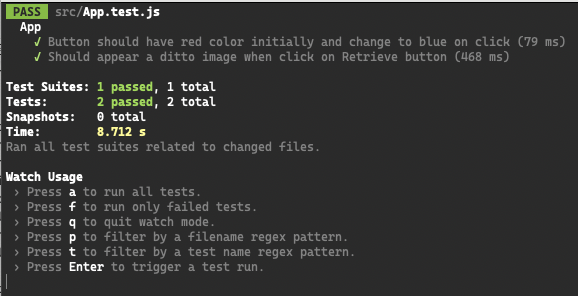

# Testing Library with Jest and React Testing Library

React testing library is a library, but it also comes with a strong philosophy. This is often called opinionated. This philosophy is to test your react components as the way an user actually uses. The idea is to be agnostic to the implementation and instead test that the software works as it should, the way is written can change, the way it works should remain. One of this mains philosophies is to avoid the use of `data-testIds`, this should be the last resource, instead is encouraged the use of accessibility markers such as text labels and waira tag roles.

Bear in mind that **Testing library** is not a framework nor a test runner, though this documentation is going to show examples with [jest](https://jestjs.io/), which is in charge of finding the test through your project and run them.

## The problem
You want to write maintainable tests for your React components. As a part of this goal, you want your tests to avoid including implementation details of your components and rather focus on making your tests give you the confidence for which they are intended. As part of this, you want your test base to be maintainable in the long run so refactors of your components (changes to implementation but not functionality) don't break your tests and slow you and your team down.

## The solution
The `React Testing Library` is a very light-weight solution for testing React components. It provides light utility functions on top of `react-dom` and `react-dom/test-utils`, in a way that encourages better testing practices. Its primary guiding principle is:

    The more your tests resemble the way your software is used, the more confidence they can give you.

This library encourages your applications to be more accessible and allows you to get your tests closer to using your components the way a user will, which allows your tests to give you more confidence that your application will work when a real user uses it.

### Things to be clear
React testing library is in charge and helps with:
- Rendering components into a virtual DOM.
- Searching the virtual DOM.
- Interact with the virtual DOM.

However, by itself can not run test, it needs something to run the test, look for them, make the assertions, this is where jest comes in.

### TDD: Test Driven Development
Test Driven Development is the pattern where you write your test before your code. Then, you write you code to make those test to pass. At the beginning you would expect your test to fail, and then you'll write actual code. The question here is _Why?_ to do this, the main reason is because it makes a big difference in how it feels to write tests, it will then become part of the development process instead ofa a "chore" at the end.

### Types of tests
- **Unit tests**: Test one unit of code in isolation, for instance a functionality of a component.
- **Integration tests;** Tests interaction within components, how multiple units works together, for instance, microservices calls.
- **End to end tests** Tests a full workflow of your application in a real environment.

### React testing library philosophy
We can start off by first saying what react testing library does:
- It creates a virtual DOM for testing.
- It interacts with that virtual DOM.
- Allows to test our web app without an actual web browser.

The Testing Library family of libraries is a very light-weight solution for testing without all the implementation details. The main utilities it provides involve querying for nodes similarly to how users would find them. In this way, testing-library helps ensure your tests give you confidence in your UI code.

Some of its features are:
- It takes away excessive work required to test React components well.
- It is backed up as well as recommended by the React community.
- It is not React specific and can be used with Angular and other languages.
- It enables testers to write quality tests that ensure complete accuracy.
- Encourages applications to be more accessible.
- It offers a way to find elements by a data-testId for elements where the text content and label don’t make sense.
- Avoids testing the internal component state.
- Tests how a component renders.

Testing library only expose methods and utilities that encourage you to write tests that closely resemble how your web pages are used. Utilities are included based on the following guiding principles:
1. If it relates to rendering components, then it should deal with DOM nodes rather than component instances, and it should not encourage dealing with component instances.

2. It should be generally useful for testing the application components in the way the user would use it. We are making some trade-offs here because we're using a computer and often a simulated browser environment, but in general, utilities should encourage tests that use the components the way they're intended to be used.
 
4. Utility implementations and APIs should be simple and flexible

### Jest Assertions
The assertions determines whether the test passes or fails. The anatomy of an assertions is as follows:

```js
expect(linkElement).toBeInTheDocument();
```
The `expect` is the way you say jest you are doing an assertion, `linkElement` is what you are testing against, in other words, thats what jest will examine to see if it meets your test expectations. Finally the matcher, in this case `toBeInTheDocument`, this is the type of the assertion. Bear in mind that sometimes that the matcher could receive arguments, for instance, the `toBe(arg)` matcher receives an argument to math whatever you want your testing target to be.

### logRoles
This helper function can be used to print out a list of all the implicit ARIA roles within a tree of DOM nodes, each role containing a list of all of the nodes which match that role. This can be helpful for finding ways to query the DOM under test with [getByRole](https://testing-library.com/docs/queries/byrole/).
```js
import {logRoles} from '@testing-library/dom'

const nav = document.createElement('nav')
nav.innerHTML = `
<ul>
  <li>Item 1</li>
  <li>Item 2</li>
</ul>`

logRoles(nav)
```
Will output:
```
navigation:
<nav />
--------------------------------------------------
list:
<ul />
--------------------------------------------------
listitem:
<li />
<li />
--------------------------------------------------
```
To learn more about ARIA roles go to: [Aria Roles](https://developer.mozilla.org/en-US/docs/Web/Accessibility/ARIA/Roles)

### user-event
Is a companion library for Testing Library that simulates user interactions by dispatching the events that would happen if the interaction took place in a browser.

esting Library's built-in fireEvent is a lightweight wrapper around the browser's low-level dispatchEvent API, which allows developers to trigger any event on any element. The problem is that the browser usually does more than just trigger one event for one interaction. For example, when a user types into a text box, the element has to be focused, and then keyboard and input events are fired and the selection and value on the element are manipulated as they type. 

    **user-event** allows you to describe a user interaction instead of a concrete event.

### So... When to Unit test?
Unit test helps with covering all possible edge cases, but you should not fire up and try to cover all the component's edge cases, this would be impossible. 

### Queries
Queries are the methods that Testing Library gives you to find elements on the page. There are several types of queries ("get", "find", "query"); the difference between them is whether the query will throw an error if no element is found or if it will return a Promise and retry. Depending on what page content you are selecting, different queries may be more or less appropriate. See the priority guide for recommendations on how to make use of semantic queries to test your page in the most accessible way.

After selecting an element, you can use the Events API or user-event to fire events and simulate user interactions with the page, or use Jest and jest-dom to make assertions about the element.

There are Testing Library helper methods that work with queries. As elements appear and disappear in response to actions, Async APIs like waitFor or findBy queries can be used to await the changes in the DOM. To find only elements that are children of a specific element, you can use within. If necessary, there are also a few options you can configure, like the timeout for retries and the default testID attribute.
```js
import {render, screen} from '@testing-library/react' // (or /dom, /vue, ...)

test('should show login form', () => {
  render(<Login />)
  const input = screen.getByLabelText('Username')
  // Events and assertions...
})
```

### Types of queries
- Single elements:
  - `getBy...`: Returns the matching node for a query, and throw a descriptive error if no elements match or if more than one match is found (use getAllBy instead if more than one element is expected).
  - `queryBy...`: Returns the matching node for a query, and return null if no elements match. This is useful for asserting an element that is not present. Throws an error if more than one match is found (use queryAllBy instead if this is OK).
  - `findBy...`: Returns a Promise which resolves when an element is found which matches the given query. The promise is rejected if no element is found or if more than one element is found after a default timeout of 1000ms. If you need to find more than one element, use findAllBy.
- Multiple elements:
  - `getAllBy...`: Returns an array of all matching nodes for a query, and throws an error if no elements match.
  - `queryAllBy...`: Returns an array of all matching nodes for a query, and return an empty array ([]) if no elements match.
  - `findAllBy...`: Returns a promise which resolves to an array of elements when any elements are found which match the given query. The promise is rejected if no elements are found after a default timeout of 1000ms.

# IMPORTANT!
### priority
Based on the testing library philosophy, your test should resemble how users interact with your code (component, page, etc.) as much as possible. With this in mind, we recommend this order of priority:

1. `getByRole`: This can be used to query every element that is exposed in the accessibility tree. With the name option you can filter the returned elements by their accessible name. This should be your top preference for just about everything. There's not much you can't get with this (if you can't, it's possible your UI is inaccessible). Most often, this will be used with the name option like so: getByRole('button', {name: /submit/i}). Check the list of roles.
2. `getByLabelText`: This method is really good for form fields. When navigating through a website form, users find elements using label text. This method emulates that behavior, so it should be your top preference.
3. `getByPlaceholderText`: A placeholder is not a substitute for a label. But if that's all you have, then it's better than alternatives.
4. `getByText`: Outside of forms, text content is the main way users find elements. This method can be used to find non-interactive elements (like _divs_, spans, and paragraphs).
5. `getByDisplayValue`: The current value of a form element can be useful when navigating a page with filled-in values.

### Jest mocking
Manual mocks are used to stub out functionality with mock data. For example, instead of accessing a remote resource like a website or a database, you might want to create a manual mock that allows you to use fake data. This ensures your tests will be fast and not flaky. You can mock a module with the functionality of `jest.mock('/path', () => mockCallback())`

## Debugging
### Jest
Jest runner gives ways to check what could be going on with your tests. A way to see what happens with an specific test is by filtering them by name, to do so, you can press the letter `p` as it indicates in the CLI:

Then, you'll be asked to write the name of the file you'd want to focus.

Another way is to tell jest to run only one suit of tests or only one unit test, you do so by prefixing the test or the unit test with an f such as:
```js
fit('name of your unit test', () => {
  /* Your tests goes here */
});

fdescribe('name of your unit test', () => {
  /* Your test suit goes here */
})
```

### Testing library:
Testing library has an automatic option that debugs the current DOM when any of the queries you make fails:
```bash
Unable to find an element with the text: Goodbye world. This could be because the text is broken up by multiple elements. In this case, you can provide a function for your text matcher to make your matcher more flexible.
Here is the state of your container:
<div>
  <div>
    Hello world
  </div>
</div>
```
Testing library also gives you tools to log the current DOM on demand with the `prettyDom` method:
```js
import {prettyDOM} from '@testing-library/dom'

const div = document.createElement('div')
div.innerHTML = '<div><h1>Hello World</h1></div>'
console.log(prettyDOM(div))
// <div>
//   <h1>Hello World</h1>
// </div>
```
As a shortcut, you could use `screen.debug()` method which would print the whole DOM if not arguments passed.

**logRoles()**
his helper function can be used to print out a list of all the implicit ARIA roles within a tree of DOM nodes, each role containing a list of all of the nodes which match that role. This can be helpful for finding ways to query the DOM under test with `getByRole`.
```js
import {logRoles} from '@testing-library/dom'

const nav = document.createElement('nav')
nav.innerHTML = `
<ul>
  <li>Item 1</li>
  <li>Item 2</li>
</ul>`

logRoles(nav)
```
Would have the following output:
```bash
navigation:
<nav />
--------------------------------------------------
list:
<ul />
--------------------------------------------------
listitem:
<li />
<li />
--------------------------------------------------
```
A good tip is to log all the current roles of your DOM by passing the containe of your app like so:
```js
import { logRoles } from '@testing-library/dom';

test('button has correct initial color', () => {
  const { container } = render(<App />);
  logRoles(container);
})
```

### Resources
On this webpage you can find some useful tips and common mistakes while using _Testing library_
[Kent C. Dodd's post on Common Mistakes with React Testing Library.](https://kentcdodds.com/blog/common-mistakes-with-react-testing-library)