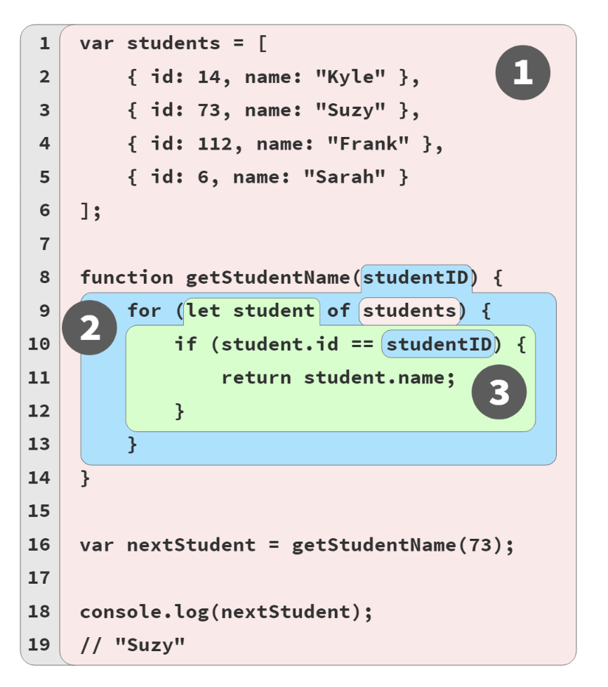

# You don't know Js yet: Scopes & Closures

## Chapter 2: Illustrating Lexical Scope
Scopes are generated in compilation time. An easy way to visualize the scopes is like bubbles like so:

The GREEN(3) bucket is wholly nested inside of the BLUE(2)bucket, and similarly the BLUE(2) bucket is wholly nested inside the RED(1) bucket. Scopes can nest inside each other as shown, to any depth of nesting as your program needs.

References (non-declarations) to variables/identifiers are al-lowed if there’s a matching declaration either in the current scope, or any scope above/outside the current scope, but not with declarations from lower/nested scopes.

### Accidental global scope
When not in _strict_ mode, an assignation to an undeclared variable could cause in a creation of a global scoped variable which could potentially lead in a memory leak, consider:
```js
function getStudentName() {
  nextStudent = 'suzy'
}

getStudentName();

console.log(nextStudent);
// Suzy -- An accidentally created global variable.
```
As you can see, even though the variable _nextStudent_ does not exist, the engine will create it and, this only would happen in a non _strict_ mode. Yet another reason why to always use _strict_ mode.
