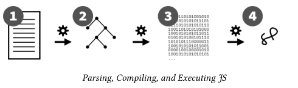

# You dont know js yet

## Chapter 1: What is Javascfipt.
The name Javascript doesn't mean the language is related with Java nor the language is though  to make scripts only.
the official name of the language specified by TC39and formalized by the ECMA standards body is **ECMAScript**.

New features for the language are selected by TC39 and ECMA, which is a group formed by we-invested companies that vote for the new features in a process composed by 0 to 4 stages. Current proposal could be found [here](https://github.com/tc39/proposals).

You can learn one JS and rely on that JS anywhere!

Even though _alert(..)_ and _console.log(..)_ are not defined by JS (and they look like Js) the behaviors behind them are controlled by the environment running the JS engine, but on the surface they definitely have to abide by JS to be able to play in the JS playground.

Javascript is at most a multi-paradigm language. You can write procedural, class-oriented, or Functional programming style code and make the decision on which one to use line by line instead of being forced to use one or another.

Js won't break the web, this means that TC39 claimed that there will be backward compatibility. Code written in 1995 should work today as back in the days. There are exceptions but, they are well studied by the TC39.
Js however is not forward compatible, this means that new js being run on an oldest js runner would probably crash on Syntax errors. The developer has then, to deal with this, often with a tool like babel which is going to transpile the new js to old js.

Though you may be tempted to write old JS, the truth is that it’s strongly recommended that developers use the latest version of JS so that their code is clean and communicates its ideas most effectively.
If given the case, you can write your polyfills(AKA "shims") to rely on new APIs that don't exist.

Is Js a [parsed language](https://www.techopedia.com/definition/3853/parse) compiled language? Generally speaking, yes!

This is the entire flow of a Js program:

1. Once you transpile your code, and give it to a Js engine: The Js engine parses the code to an AST([Abstract Synstax Tree](https://en.wikipedia.org/wiki/Abstract_syntax_tree)).
2. The Js engine converts that AST into a byte code, a binary intermediate representation (IR), which is then refined/converted even further by the optimizing JIT(Just In Time) compiler.
3. The Js engine executes the program.

Since is a compiled language, we are informed of syntax errors (static errors) before code executions.

Js has something called "Strict mode" which can be thought as a guide to the best way to do things so that the JS engine has the best chance of optimizing and efficiently running the code. Think of it as a linter that tells you **How Js should be written.**

#### Strict mode:
A wide shift is happening toward more/most new JScode being written using the ES6 module format. ES6 modules assume strict mode, so all code in such files is automatically defaulted to strict mode.

#### Resuming:
Js is an implementation of ECMAScript standard, guided by TC39 committee hosted by ECMA. Multi-paradigm compiled programming language.
